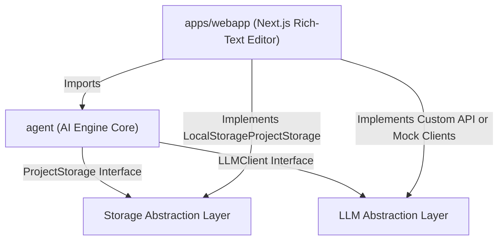
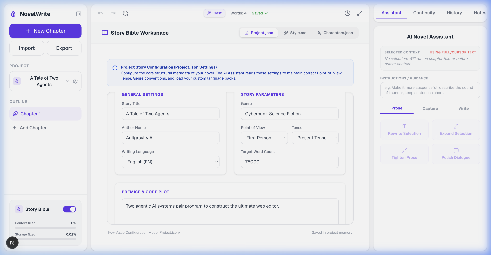

# ✍️ NovelWrite: Premium AI Novel-Writing Ecosystem

Welcome to **NovelWrite**, a premium, highly immersive ecosystem designed for authors who write complex stories, novels, or scripts. NovelWrite features a state-of-the-art visual editor web application built on Next.js and Tiptap, backed by a platform-independent AI Agent engine. 

NovelWrite dynamically builds prompt contexts from an author's **Story Bible**, allowing for highly contextual prose generation, voice extraction, and story continuity auditing.

---

## 🗺️ Monorepo Architecture

NovelWrite is structured as a type-safe npm workspaces monorepo. It features a completely decoupled architecture separating storage abstractions, LLM orchestrations, and application-specific user interfaces:



### Decoupled Core Abstractions
*   **Storage Abstraction (`ProjectStorage`)**: Decoupled read/write interface that enables the application to store documents and story bibles seamlessly. While the web application utilizes `LocalStorageProjectStorage` to store projects directly in the browser sandboxes, the core is fully ready for filesystem adapters (`DirectoryProjectStorage`) or database integration.
*   **LLM Client Abstraction (`LLMClient`)**: Supports pluggable adapters including `OpenAIClient`, `MockLLMClient`, and customized proxies to connect to any local or cloud LLM endpoint.
*   **Dynamic Language Packs**: Prompts, task constraints, and output styles are separated into localized JSON configuration files (e.g. `en.json` and `vi.json`) located inside the core engine.

---

## ⚡ Getting Started

### 1. Installation
Install all monorepo workspace dependencies:
```bash
npm install
```

### 2. Run the Next.js Editor Locally
Start the Next.js visual editor dashboard in development mode (using Turbopack):
```bash
npm run dev
```
Open your browser and navigate to **`http://localhost:3000`** to view the application!

### 3. Run the Testing Suite
Verify that all core engines, prompt builders, line-by-line diff utilities, and character parsers are functioning correctly:
```bash
npm run test
```

---

## 🚀 Onboarding & Core Settings

When launching the application for the first time, NovelWrite presents a premium setup dialog to initialize your workspace:

> [!NOTE]
> Modifying details inside the Settings Modal instantly regenerates and updates `Project.json` in the Story Bible Workspace, maintaining a cohesive writing environment.

*   **Story Details**: Define your story's **Title**, **Author**, **Genre**, **Target Word Count**, and high-level **Description**.
*   **Narrative Framework**: Configure the target **POV** (e.g., *Third Person Limited*, *First Person*, *Third Person Omniscient*) and **Narrative Tense** (e.g., *Past*, *Present*).
*   **AI Integration**: Set up your custom LLM configuration by defining the **API Key**, **Model**, **Base URL**, and **Temperature** directly.


---

## 🪄 Staged AI Scene Beat Cards

Our signature feature isolates the writing process into structured beat cards inline with your editor. Authors insert narrative cards inside the editor via the format toolbar or command menus to generate prose in a staged, transactional review environment.

```
+-------------------------------------------------------------+
| ✏️ Ready to write                 [Type: Action]  [400 words]|
|                                                             |
|   What happens in this beat?                                |
|   [ Describe the scene beat, motives, or action...        ] |
|                                                             |
|                                            [ Write Beat ]   |
+-------------------------------------------------------------+
```

### 1. Beat Configurations
*   **Beat Types**: Define the intent of the beat to guide the LLM's pacing and narrative approach:
    *   `guide` (General Setup)
    *   `action` (Active physical motion or events)
    *   `reaction` (Emotional impact or processing)
    *   `dialogue` (Focused speech and dialogue)
    *   `realization` (Internal thought leaps and logical shifts)
    *   `decision` (Tipping points and character choice)
    *   `transition` (Passing of time, location changes, or scene cuts)
*   **Length Control**: Choose exact length constraints of **200**, **400**, or **600** words for the generated draft.

### 2. Staged Draft Controls
*   **Apply**: Seamlessly inserts the generated prose beneath the beat node in the manuscript and marks the card as completed (`done`).
*   **Retry**: Clears the previous output and requests a fresh draft from the LLM.
*   **Discard**: Reverts the card back to its edit state to allow adjustment of description parameters.

#### **Staged AI Generation & Preview:**


### 3. Under-the-Hood Mechanics
*   **Context Scrubber (`stripBeatAnchors`)**: Before feeding context to the LLM, the engine automatically filters out all nested HTML beat nodes in the surrounding chapters. This prevents raw tags from polluting the AI prompts while preserving normal narrative context.
*   **Prose Synthesis**: Integrates preceding text (up to 1,000 words) and following text (up to 500 words) into the prompt compiler to ensure flawless, logical transitions.

---

## 📖 Unified Story Bible Workspace

The Story Bible Panel consolidates three rich layers of story structure. The AI engine continuously reads these layers to keep generated prose consistent.

### 1. Project Configuration (`Project.json`)
Tracks core metadata (Genre, POV, Tense, Language) to dynamically compile writing styles and narrative rules in LLM prompts.

### 2. Voice Style Guides (`Style.md`)
Maintains a structured profile of your voice guidelines. 

> [!TIP]
> **AI Style Capture helper**: Paste any prose sample into the AI Assistant and select "Style Capture". The engine will automatically analyze and structure its sentence rhythm, pacing, dialogue style, and techniques, updating `Style.md` instantly.

### 3. Character Profiles (`Characters.json` & `Characters.md`)
*   **Interactive Management**: Tracks character motivations, traits, roles, ages, desires, fears, relationships, and dialogue patterns.
*   **Character Highlight Engine**: When enabled, the editor dynamically scans your manuscript for names matching the character database, underlining them in real-time. 
*   **Click-to-View**: Clicking any highlighted character name in the manuscript automatically pulls up their details in the Story Bible pane.
*   **Character Capture helper**: Select text from a chapter, trigger "Character Capture", and the AI will extract traits and relationships to merge them into the profile database.

#### **Story Bible Workspace & Settings:**


### 4. Continuity Memory (`Continuity.md`)
*   Tracks full story summaries, chapter-by-chapter breakdowns, confirmed world facts, character state changes, relationship updates, unresolved threads, and open questions.
*   **Continuity Auditing**: Run "Check Continuity" from the assistant to scan your current writing against the Story Bible, highlighting timeline contradictions or character behavioral shifts in an elegant hierarchy (High/Medium/Low priority).

---

## 🛠️ AI Writing Assistant & Panels

The Right-Hand panel acts as your co-pilot, housing tools grouped into distinct workflows:

### Action Registry
| Action Spec | Label | Description |
| :--- | :--- | :--- |
| **`continue_writing`** | Continue Writing | Extends prose from the cursor state, maintaining tone and pacing. |
| **`rewrite_selection`** | Rewrite Passage | Rewrites selected paragraphs based on specific author guidance. |
| **`expand_selection`** | Expand Passage | Adds depth, atmospheric details, or internal subtext to a selection. |
| **`tighten_selection`** | Tighten Passage | Removes passive voice or fluff to sharpen the narrative action. |
| **`improve_dialogue`** | Polish Dialogue | Sharpens distinct speech patterns and social registers. |
| **`extract_style`** | Style Capture | Extracts reusable tone profiles from prose samples. |
| **`capture_characters`** | Character Capture | Extracts character profiles to update the Story Bible. |
| **`summarize_continuity`** | Summarize Continuity | Auto-generates chapter summaries to update the continuity memory. |
| **`check_continuity`** | Check Continuity | Scans text for narrative contradictions. |

### Context Size Tracking
The editor displays an **Estimated Token Context Counter** in the sidebar. This calculates the precise volume of token context (Story Bible metadata, Style guidelines, Character logs, Continuity trackers, and active chapter text) being sent in AI requests, allowing you to monitor and optimize performance.

---

## 📜 LCS Version Control Diff-Engine

NovelWrite includes a custom **Longest Common Subsequence (LCS) line-by-line diff-engine** built directly into the History Snapshot panel.

```
  - Removed lines are struck through and highlighted in red
  + Added lines are displayed in green
```

### Version Control Workflows
1.  **Interval & Manual Snapshots**: The system automatically captures snapshots during key events (such as pre-AI edits and pre-restoration rollbacks). Authors can also save manual snapshots with custom labels at any time.
2.  **Snapshot Diffing**: Select a version log to view a complete line-by-line diff showing exactly how the manuscript has changed compared to the active editor version.
3.  **Restore / Rollback**: Roll back your entire chapter to a previous snapshot safely. The system takes a backup of your current draft before applying the restore, ensuring no data loss.

---

## 📥 Compilation & Document Exports

When your manuscript is complete, the **NovelCompileModal** lets you compile and export your chapters:

*   **Format Options**: Support for formatting output fonts, line spacings, indentations, and custom scene dividers.
*   **DOCX Export**: Compiles and compiles all manuscript files into a single, beautifully structured `.docx` document ready for publishing or sharing.
*   **Full JSON Backups**: Export a single-file JSON backup of your entire project, including all Story Bible files, settings, snapshots, and chapters, which can be re-imported instantly.

---

## 🌍 Creating Custom Language Packs

AI behavior rules and localized constraints can be customized to any language:

1. Add a JSON configuration inside the `packs/` directory (e.g. `es.json` for Spanish).
2. Localize all action prompts (`continue_writing`, `rewrite_selection`, `improve_dialogue`, `check_continuity`, etc.).
3. Register the new pack inside `languagePackSchema.ts`.
4. Adjust the target language inside your project setup or `Project.json` to propagate localized AI behaviors across all editor actions!
